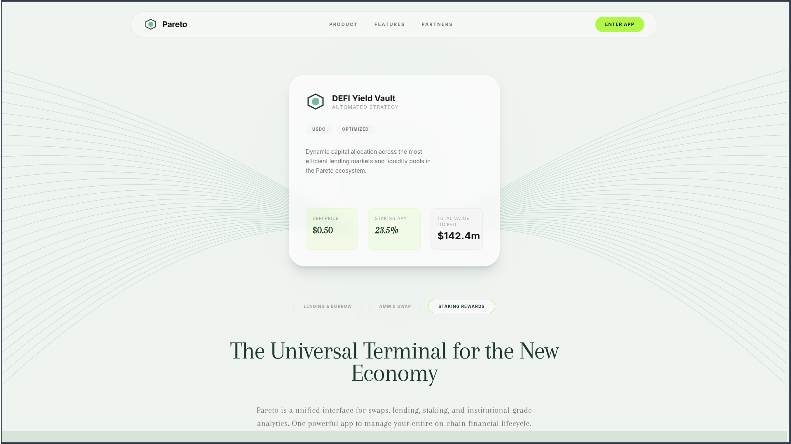
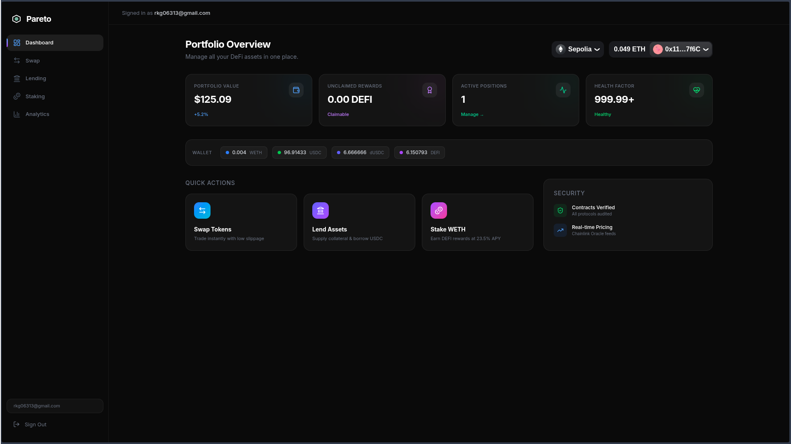
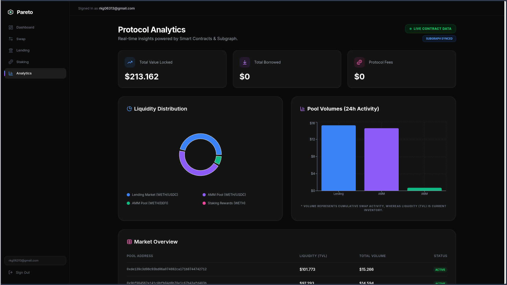
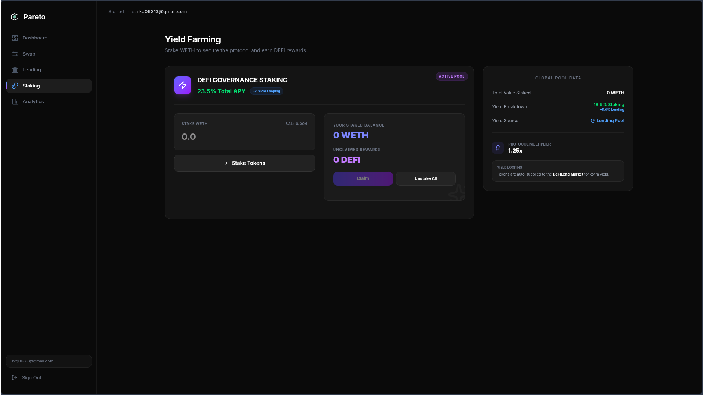
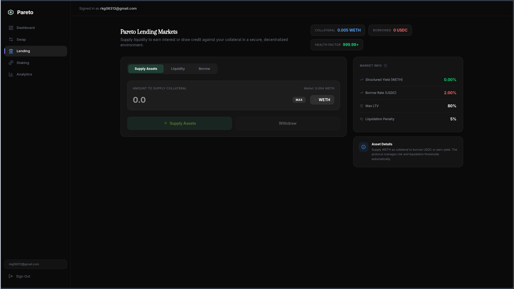
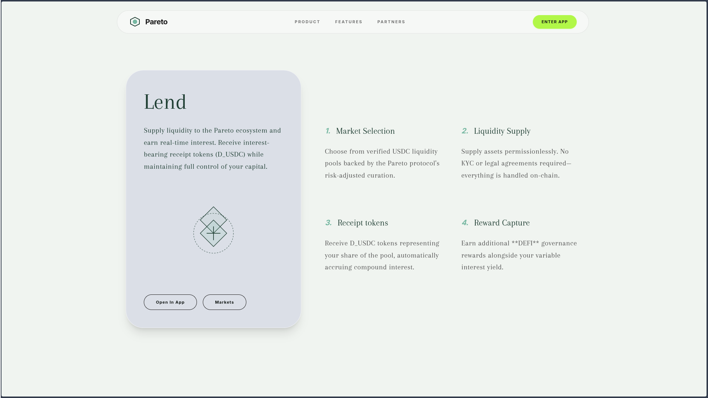
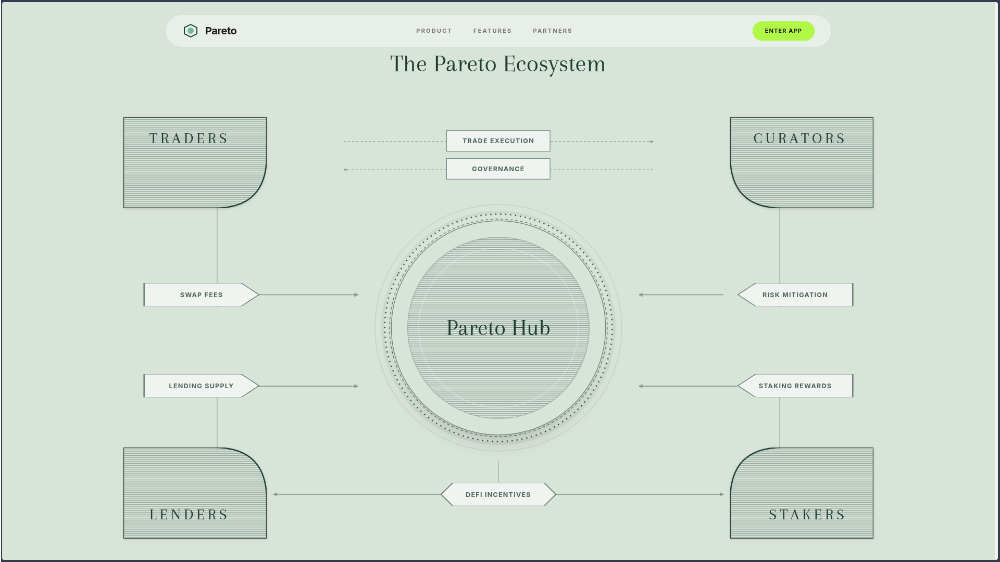
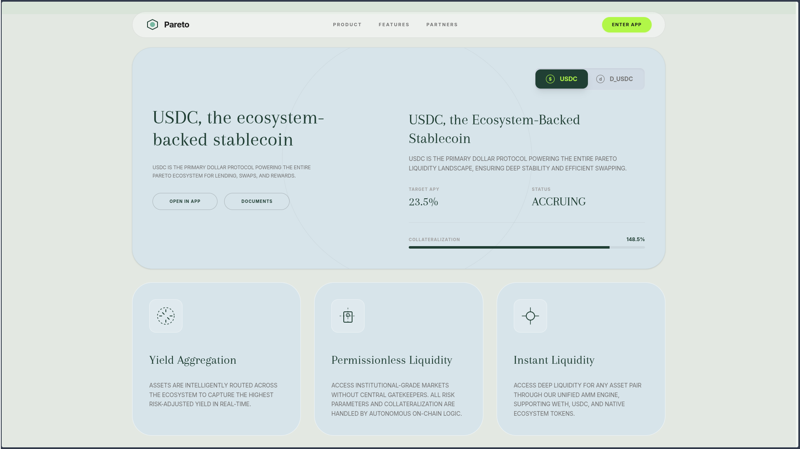
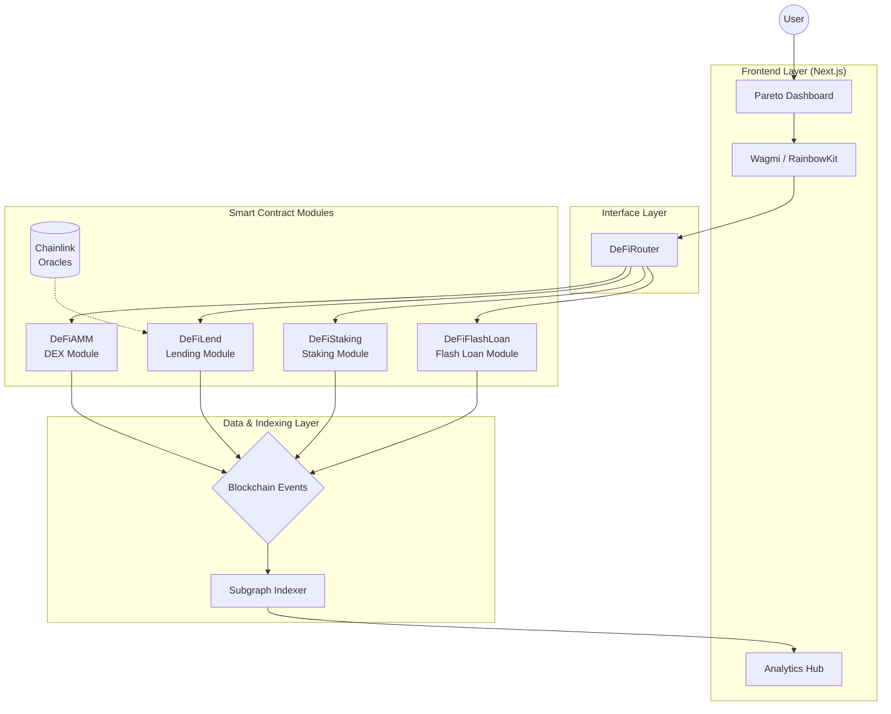
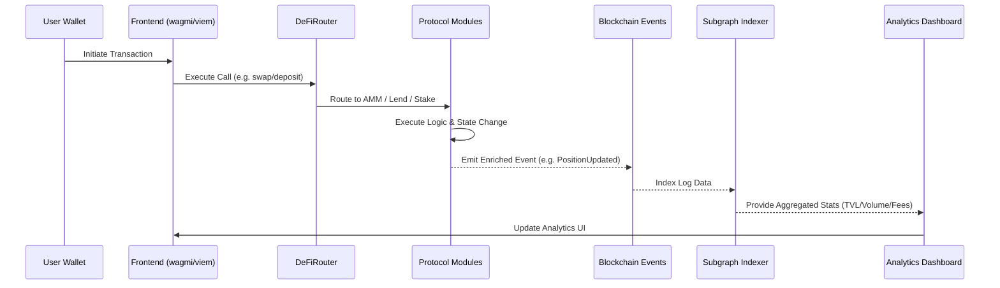

# 🏛 Pareto — Institutional-Grade DeFi Terminal

A modular, gas-optimized DeFi protocol built with Foundry & Solidity. Features a Constant Product AMM, over-collateralized lending with Chainlink oracles, yield-looping staking rewards, and full subgraph indexing.

---

## 📸 Application Screenshots

Here are some key screenshots from the Pareto Terminal:

  
_Pareto Landing Page — Premium Dark UI_

  
_Unified Portfolio Dashboard — Multi-Asset Overview_

  
_On-Chain Analytics Hub — Subgraph-Powered Metrics_

  
_Incentivized Staking — Automated Yield Looping_

## 🚀 Visual Flow

| Lending & Supply                     | Over-collateralized Borrowing     |
| ------------------------------------ | --------------------------------- |
|  |  |

| Protocol Architecture                        | Infrastructure & Security               |
| -------------------------------------------- | --------------------------------------- |
|  |  |

---

## 🏗 Protocol Architecture

### System Layers

This diagram illustrates the high-level architecture of the Pareto Terminal, showing the flow from the user interface through the smart contract logic to the indexing and analytics layer.



### Smart Contract Interaction Flow

The following sequence describes how a user transaction (e.g., a swap or a deposit) is processed, indexed, and eventually reflected in the analytics suite.



---

## 📦 Smart Contracts

### DeFiAMM — Constant Product AMM

**`src/DeFiAMM.sol`**

| Feature       | Detail                                                  |
| ------------- | ------------------------------------------------------- |
| Pricing       | `x * y = k` constant product formula                    |
| LP Tokens     | Inline ERC20 (name: "DeFi LP Token", symbol: "DLP")     |
| Swap Fee      | 0.3% — accrues to LP holders via k-value growth         |
| Min Liquidity | First 1000 LP tokens permanently locked to `address(1)` |
| Security      | `nonReentrant`, `whenNotPaused`, `SafeERC20`            |
| Protocol Fee  | 16.6% of 0.3% swap fee (≈0.05%) to treasury             |

**Key Functions:**

- `addLiquidity(amount0, amount1)` → mints LP tokens
- `removeLiquidity(shares)` → burns LP tokens, returns proportional assets
- `swap(amount0Out, amount1Out, to)` → swaps with k-invariant check
- `sync()` → forces reserves to match balances
- `skim(to)` → recovers excess tokens sent to pool

---

### DeFiLend — Lending Protocol

**`src/DeFiLend.sol`**

| Feature           | Detail                                                |
| ----------------- | ----------------------------------------------------- |
| Model             | Over-collateralized lending                           |
| **Pricing**       | **Chainlink Oracle Integration (AggregatorV3)**       |
| Threshold         | 80% LTV (Loan-to-Value)                               |
| Liquidation Bonus | 5% — incentivizes liquidators                         |
| Close Factor      | 50% — max per liquidation transaction                 |
| Interest Model    | Linear Utilization-based (2% base + 10% slope)        |
| Receipt Tokens    | `d[ASSET]` (e.g., dUSDC) represents pool share        |
| Struct Packing    | `uint128` collateral + borrow in single storage slot  |
| Security          | Staleness checks (48h max), ReentrancyGuard, Pausable |

**Key Functions:**

- `deposit(amount)` — deposit collateral (emits `PositionUpdated`)
- `borrow(amount)` — borrow against collateral (emits `PositionUpdated`)
- `repay(amount)` — repay debt (emits `PositionUpdated`)
- `supplyBorrowToken(amount)` — supply liquidity to earn interest
- `withdrawLiquidity(amount)` — withdraw supplied liquidity
- `liquidate(user, amount)` — execute liquidation via oracle prices (emits `LiquidationExecuted`)

---

### DeFiStaking — Reward Distribution

**`src/DeFiStaking.sol`**

| Model | Reward-per-token cumulative distribution |
| Default Rate | 1 token/second |
| Yield Looping| Staked assets supplied to Lending Pool |
| Security | `nonReentrant`, `whenNotPaused`, `SafeERC20` |

**Key Functions:**

- `stake(amount)` — stake tokens to earn rewards
- `withdraw(amount)` — withdraw staked tokens
- `getReward()` — claim accumulated rewards

---

### DeFiFlashLoan — Flash Loan Provider

**`src/DeFiFlashLoan.sol`**

| Feature         | Detail                                      |
| --------------- | ------------------------------------------- |
| Pattern         | EIP-3156 compatible                         |
| Fee             | 0.09% (9 basis points)                      |
| Callback        | `IFlashBorrower.onFlashLoan()`              |
| Token Whitelist | Owner configures supported tokens           |
| **Events**      | Enriched `FlashLoanExecuted` with initiator |

**Key Functions:**

- `flashLoan(receiver, token, amount, data)` — execute loan
- `flashFee(amount)` — calculate fee
- `maxFlashLoan(token)` — available liquidity

---

### DeFiRouter — User-Facing Router

**`src/DeFiRouter.sol`**

- Handles token approvals and transfers for AMM operations
- Deadline parameter for front-running protection
- Slippage protection on swaps (`amountOutMin`)

---

## 📍 Deployed Addresses (Sepolia)

The protocol is currently live on the Sepolia Testnet with the following infrastructure:

### Core Contracts

| Contract          | Address                                      |
| ----------------- | -------------------------------------------- |
| **DeFiAMM**       | `0x9bf904562e141c0bfb04d8b70e1c67b43afd403b` |
| **DeFiRouter**    | `0x89e46db557b013a75e788d5faadfb600f89b569c` |
| **DeFiLend**      | `0xde139c3d98c93bd06a074692ca171b8744742712` |
| **DeFiStaking**   | `0x618d4c16fb2d34101c32968f90986ad6f5e23caf` |
| **DeFiFlashLoan** | `0xded027a033a1106d7a85de74afe54e628faa4d39` |

### Protocol Tokens

| Token            | Symbol  | Address                                      |
| ---------------- | ------- | -------------------------------------------- |
| **DeFi Token**   | `DEFI`  | `0xd672dccec15daf786238d11c22c1fa3f77f2b287` |
| **Receipt USDC** | `dUSDC` | `0x835e2ca78249f36345cf8d5d487dc3fa03aaded6` |
| **WETH**         | `WETH`  | `0xfFf9976782d46CC05630D1f6eBAb18b2324d6B14` |
| **USDC**         | `USDC`  | `0x1c7D4B196Cb0C7B01d743Fbc6116a902379C7238` |

### External Infrastructure

| Resource       | Name / Detail | Address                                      |
| -------------- | ------------- | -------------------------------------------- |
| **Price Feed** | `ETH / USD`   | `0x694AA1769357215DE4FAC081bf1f309aDC325306` |
| **LP Pool**    | `WETH / USDC` | `0x9bf904562e141c0bfb04d8b70e1c67b43afd403b` |

---

## 🔒 Security Patterns

All contracts implement:

| Pattern             | Purpose                                                     |
| ------------------- | ----------------------------------------------------------- |
| **ReentrancyGuard** | Prevents reentrancy attacks on all state-changing functions |
| **Ownable**         | Admin access control for pause/unpause and configuration    |
| **Pausable**        | Emergency circuit breaker — owner can halt all operations   |
| **SafeERC20**       | Safe token transfers with return value checking             |
| **Custom Errors**   | Gas-efficient error handling (vs revert strings)            |
| **Deadline**        | Front-running protection on Router operations               |

---

## ⛽ Gas Optimizations

| Technique                  | Applied In                                                |
| -------------------------- | --------------------------------------------------------- |
| `immutable` variables      | Token addresses across all contracts                      |
| Struct packing (`uint128`) | `DeFiLend.UserAccount` — single storage slot              |
| Storage caching            | Local variables for `reserve0`, `reserve1`, `totalSupply` |
| Custom errors              | All contracts — saves ~200 gas vs revert strings          |
| `unchecked` arithmetic     | Liquidation bonus calculation, fee tracking               |
| `forceApprove`             | Router — avoids approval race conditions                  |

---

## 📊 Subgraph Indexing

The `subgraph/` directory contains a complete [The Graph](https://thegraph.com/) indexer.

### Enriched Events

The protocol emits detailed events designed for high-fidelity indexing and the Analytics Dashboard.

| Event                 | Purpose                                                                                         |
| --------------------- | ----------------------------------------------------------------------------------------------- |
| `PositionUpdated`     | Tracks every lending deposit, withdraw, borrow, and repay with post-action balances.            |
| `LiquidationExecuted` | Details on user, liquidator, debt repaid, collateral seized, and pre-liquidation health factor. |
| `FlashLoanExecuted`   | Logs the borrower, token, amount, fee, and the transaction initiator.                           |
| `Swap`                | Native AMM swap data including input/output amounts.                                            |

### Indexing Setup

```bash
cd subgraph
npm install
npm run codegen
npm run build
npm run deploy
```

---

## 🚀 Deployment

### Prerequisites

- [Foundry](https://book.getfoundry.sh/) installed
- RPC endpoint (Alchemy, Infura, etc.)
- Deployer private key with ETH for gas

### Build & Test

```bash
cd contracts

# Build
forge build

# Run tests
forge test -vvv

# Gas report
forge test --gas-report
```

### Deploy

```bash
# Set environment variables
export TOKEN0_ADDRESS=0x...
export TOKEN1_ADDRESS=0x...
export COLLATERAL_TOKEN=0x...
export BORROW_TOKEN=0x...
export STAKING_TOKEN=0x...
export REWARD_TOKEN=0x...

# Deploy to network
forge script script/Deploy.s.sol:Deploy \
  --rpc-url $RPC_URL \
  --private-key $DEPLOYER_KEY \
  --broadcast \
  --verify \
  --etherscan-api-key $ETHERSCAN_KEY
```

---

## 🧪 Test Suite

**38 tests across 5 suites — all passing ✅**

| Suite             | Tests | Coverage                                                   |
| ----------------- | ----- | ---------------------------------------------------------- |
| DeFiAMM           | 7     | Add/remove liquidity, swap, min liquidity, pause, deadline |
| DeFiLend          | 12    | Oracle health checks, stale prices, liquidation, events    |
| DeFiStaking       | 6     | Stake, withdraw, rewards, multi-staker                     |
| DeFiFlashLoan     | 11    | Success, bad repay, bad callback, fees, events, access     |
| Counter & Default | 2     | Foundry default                                            |

---

## 📁 Project Structure

```
Pareto/
├── contracts/                # Foundry project
│   ├── src/
│   │   ├── DeFiAMM.sol       # AMM with LP tokens
│   │   ├── DeFiLend.sol      # Lending protocol
│   │   ├── DeFiStaking.sol   # Staking rewards
│   │   ├── DeFiFlashLoan.sol # Flash loans
│   │   ├── DeFiRouter.sol    # User router
│   │   └── IFlashBorrower.sol# Flash loan interface
│   ├── test/                 # Forge test suite
│   ├── script/               # Deployment scripts
│   └── lib/                  # Dependencies (forge-std, OZ)
├── subgraph/                 # The Graph indexer
│   ├── schema.graphql
│   ├── subgraph.yaml
│   └── src/                  # Event handlers
└── frontend/                 # Next.js dashboard
```

---

## 🛠 Tech Stack

- **Smart Contracts**: Solidity 0.8.20+, Foundry
- **Security**: OpenZeppelin Contracts v5.6.1
- **Testing**: Forge Test (with fuzz testing)
- **Indexing**: The Graph Protocol
- **Frontend**: Next.js, wagmi, RainbowKit, viem
- **Styling**: Tailwind CSS, Framer Motion

---

## 📄 License

MIT
