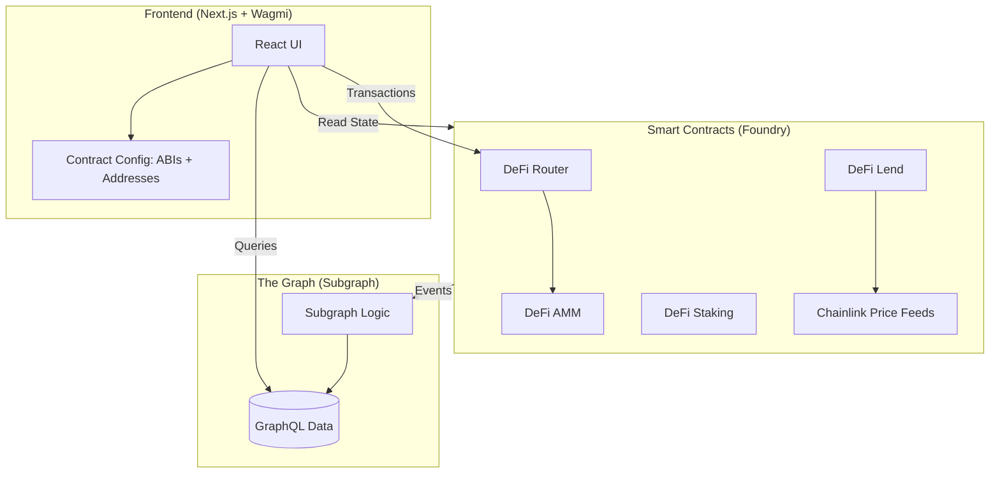

# DeFi Super App Architecture

Welcome to the **DeFi Super App** architecture documentation. This document provides a high-level overview of how the system is built, how the different layers interact, and how to maintain the project.

---

## 1. Repository Structure

The project is organized into three main top-level directories:

- **`contracts/`**: The Smart Contract layer built with **Foundry**.
  - `src/`: Main Solidity contract files.
  - `script/`: Deployment and management scripts.
  - `test/`: Solidity unit and integration tests.
  - `out/`: Compiled contract artifacts (contains ABIs).
  - `lib/`: External dependencies (OpenZeppelin, etc.).
- **`frontend/`**: The Web Frontend built with **Next.js (App Router)**.
  - `src/app/`: Application pages (Swap, Lending, Staking, Analytics).
  - `src/components/`: Reusable UI components.
  - `src/contracts/`: Contract integration layer (Addresses and ABIs).
  - `src/providers/`: Context providers (Web3, Theme, etc.).
- **`subgraph/`**: The Indexing layer built with **The Graph**.
  - `schema.graphql`: Data model definition.
  - `subgraph.yaml`: Manifest file defining data sources and event handlers.
  - `src/`: AssemblyScript mappings that translate events into entities.

---

## 2. Smart Contract Layer

The protocol consists of several specialized contracts that handle different DeFi functionalities:

- **`DeFiAMM`**: A Constant Product AMM ($x \cdot y = k$). It holds the token reserves and handles the core liquidity provisioning and swapping logic.
- **`DeFiRouter`**: The primary entry point for users interacting with the AMM. It handles token approvals, slippage protection, and multi-step interactions.
- **`DeFiLend`**: An over-collateralized lending protocol. Users deposit one asset as collateral to borrow another. It uses Chainlink price feeds to monitor health factors and execute liquidations.
- **`DeFiStaking`**: A reward distribution contract. Users stake tokens to earn rewards over time based on a reward-per-token model.
- **`DeFiFlashLoan`**: Provides uncollateralized loans that must be repaid within the same transaction, charging a small fee (9 bps).

### Contract Interactions

| Interaction              | Description                                                                       |
| :----------------------- | :-------------------------------------------------------------------------------- |
| **Frontend → Router**    | Users interact with the Router to swap or add liquidity.                          |
| **Router → AMM**         | The Router transfers tokens to the AMM and triggers the swap/mint logic.          |
| **Lending → Oracle**     | `DeFiLend` queries Chainlink `AggregatorV3` contracts for real-time asset prices. |
| **FlashLoan → Receiver** | `DeFiFlashLoan` calls the `onFlashLoan` callback on the borrower's contract.      |

---

## 3. Frontend Web3 Connection

The frontend uses **Wagmi** for blockchain interactions and **RainbowKit** for wallet connectivity.

### Configuration

Everything is configured in [Web3Provider.tsx](file:///home/kali/UserData/G/projects/DeFi_Super/frontend/src/providers/Web3Provider.tsx).

- **Wagmi**: Manages account state, balance fetching, and contract writes.
- **RainbowKit**: Provides the "Connect Wallet" UI and manages wallet providers.
- **TanStack Query**: Handles caching and synchronization of blockchain data.

### Contract Integration (`src/contracts/index.ts`)

This file acts as the **Central Registry** for the frontend. It exports:

- `CONTRACT_ADDRESSES`: A mapping of contract names to their deployed addresses.
- `CONTRACT_ABIS`: A mapping of contract names to their respective JSON ABIs.

By importing from this file, components can easily initialize Wagmi hooks:

```typescript
import { useWriteContract } from "wagmi";
import { CONTRACT_ADDRESSES, CONTRACT_ABIS } from "@/contracts";

const { writeContract } = useWriteContract();
// writeContract({ address: CONTRACT_ADDRESSES.DeFiRouter, abi: CONTRACT_ABIS.DeFiRouter, ... })
```

---

## 4. Transaction Flows

### Swap Flow

1.  **Approval**: User approves the `DeFiRouter` to spend their input token.
2.  **Router Call**: Frontend calls `DeFiRouter.swap()`.
3.  **Transfer**: Router pulls tokens from user and sends them to the `DeFiAMM` pool.
4.  **AMM Swap**: Router calls `DeFiAMM.swap()`.
5.  **Output**: AMM sends the output tokens directly to the user.

### Lending Flow

1.  **Deposit**: User approves `DeFiLend`, then calls `deposit()`. Collateral is locked.
2.  **Borrow**: User calls `borrow()`. Contract checks Health Factor via Oracles before sending tokens.
3.  **Repay**: User approves `DeFiLend`, then calls `repay()`. Debt balance is reduced.

### Staking Flow

1.  **Stake**: User approves `DeFiStaking`, then calls `stake()`.
2.  **Earn**: Rewards accrue automatically based on time and total pool share.
3.  **Claim**: User calls `getReward()` to transfer earned tokens to their wallet.

---

## 5. Subgraph Integration

The Subgraph monitors the blockchain for events emitted by the smart contracts and indexes them into a searchable GraphQL API.

- **Location**: All logic lives in the `subgraph/` directory.
- **Indexing**: When an event like `Swap(...)` or `PositionUpdated(...)` is emitted, its mapping function (in `subgraph/src/`) updates the corresponding entities in the database.
- **Frontend Querying**: The frontend uses standard GraphQL fetches (or Apollo/Urql) to retrieve historical data, such as volume charts or user position history, which cannot be efficiently fetched directly from the blockchain.

---

## 6. Contract Address Management

When deploying to a new network, update the `CONTRACT_ADDRESSES` object in [index.ts](file:///home/kali/UserData/G/projects/DeFi_Super/frontend/src/contracts/index.ts).

```typescript
export const CONTRACT_ADDRESSES = {
  DeFiAMM: "0x...",
  DeFiRouter: "0x...",
  DeFiLend: "0x...",
  // ...
};
```

> [!IMPORTANT]
> Ensure the addresses match the network currently selected in your `Web3Provider` (e.g., Localhost, Sepolia, or Mainnet).

---

## 7. Deployment Workflow

To deploy the system and update the frontend:

1.  **Deploy Contracts**: Use Foundry to deploy your contracts.
    ```bash
    cd contracts
    forge script script/Deploy.s.sol --rpc-url <YOUR_RPC> --broadcast
    ```
2.  **Extract ABIs**: Foundry outputs ABIs to `contracts/out/<ContractName>.sol/<ContractName>.json`.
3.  **Copy ABIs**: Copy these JSON files into `frontend/src/contracts/abi/`.
4.  **Update Addresses**: Copy the deployed addresses from the terminal/broadcast logs and paste them into `frontend/src/contracts/index.ts`.
5.  **Restart Frontend**: The Next.js dev server will pick up the changes and use the new addresses/ABIs.

---

## 8. Visual Architecture Diagram


