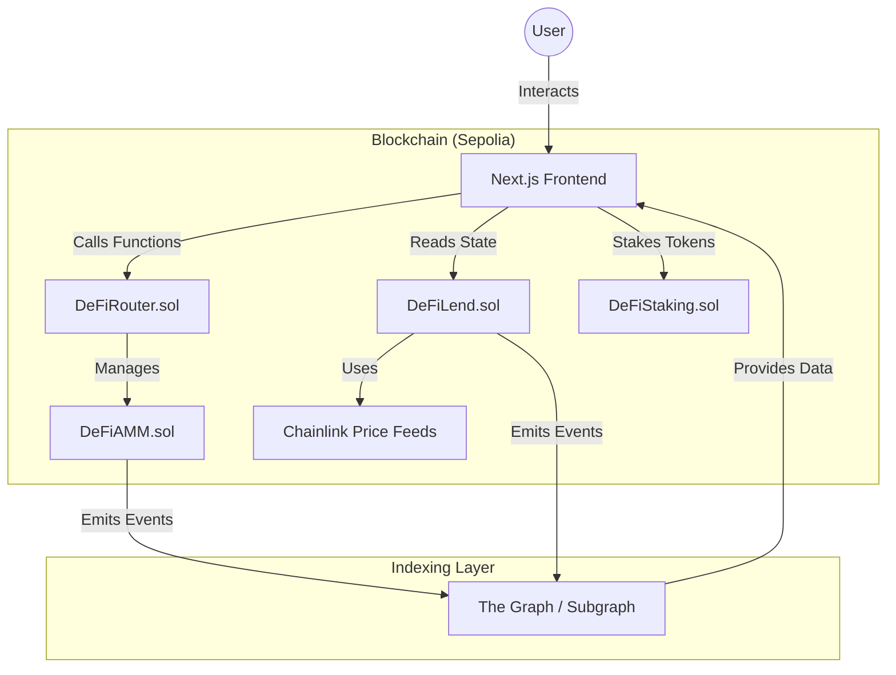

# 🏗️ DeFi Super App: Complete Architecture Guide

This guide explains how the entire project works, from the code on the blockchain to the buttons on your screen.

---

## 1. The Big Picture (How everything connects)

The app is split into three main layers:

1.  **Frontend (The Face)**: What you see in your browser (Next.js).
2.  **Smart Contracts (The Brain)**: The "Rules" that live on the Ethereum network.
3.  **Subgraph (The Memory)**: A special tool that records everything that happens on the blockchain so the app can show you charts and history.

### 🖼️ System Architecture Diagram

---

## 2. Smart Contracts (The Core Features)

Each page in the app is powered by a specific "Smart Contract" brain:

| Page / Feature  | Smart Contract                   | What it does?                                                                                              |
| :-------------- | :------------------------------- | :--------------------------------------------------------------------------------------------------------- |
| **Swap**        | `DeFiRouter.sol` & `DeFiAMM.sol` | Allows you to trade WETH for USDC. The Router is the "Helper" that finds the best price in the AMM.        |
| **Lending**     | `DeFiLend.sol`                   | Manages your collateral (WETH) and your debt (USDC). It calculates interest every second.                  |
| **Staking**     | `DeFiStaking.sol`                | Takes your tokens and gives you "Rewards" over time. Like a high-interest savings account.                 |
| **Flash Loans** | `DeFiFlashLoan.sol`              | Allows you to borrow millions of dollars for 1 second, as long as you pay it back in the same transaction. |

### ⚡ Why Flash Loans? (If I don't use them?)

You might wonder why we build this if you (the human user) don't use it.

1.  **Efficiency**: Arbitrage bots use flash loans to keep prices equal across different exchanges, which helps you get better prices!
2.  **Safety**: Liquidation bots use flash loans to repay unhealthy debts instantly, keeping the protocol safe from losses.
3.  **Developer Ready**: It makes your protocol "Professional Grade" so other developers can build tools on top of your app.

---

## 3. The Subgraph (The "History Book")

### What is it?

A Subgraph is like a **Google Search** for the blockchain. Normally, the blockchain is very good at doing math, but very bad at remembering history (like _"Who was the top swapper yesterday?"_).

### How it works:

1.  **Events**: When you Swap or Deposit, the Smart Contract "shouts" an Event (e.g., `event SwapExecuted(...)`).
2.  **Indexing**: The Subgraph "listens" to these shouts and writes them down in a database.
3.  **Analytics**: When you visit the **Analytics** page, the app asks the Subgraph for the data to draw the charts.

**Is it showing real values?**

- **Yes!** It reads directly from the blockchain. However, if you _just_ made a transaction, it might take 30-60 seconds for the Subgraph to "catch up" and show it on the chart.

---

## 4. Tokens & Price Feeds

### The Tokens (The "Money"):

- **WETH (Wrapped ETH)**: Used as **Collateral** in Lending and for **Swapping**.
- **USDC (Stablecoin)**: Used for **Borrowing**. Its price is always $1.00.
- **DEFI (Governance)**: The "Reward" token you earn from Staking.

### The Price Feeds (The "Oracle"):

How does the contract know that ETH is worth $2,500? It asks **Chainlink**.

- **Why?** Contracts cannot browse the internet. Chainlink is a bridge that brings real-world prices onto the blockchain.
- **Where?** Inside `DeFiLend.sol`, we call `collateralPriceFeed.latestRoundData()` to get the current ETH price.

---

## 5. How Funds Move (The "Flow")

- **Lending**: Your WETH is stored inside the `DeFiLend` contract. If you borrow USDC, that USDC comes from the pool of money other lenders put in.
- **Staking**: Your tokens are sent to `DeFiStaking`. The rewards (WETH/DEFI) are also stored there and slowly "leak" out to stakers.
- **Swap**: When you trade, you send WETH to the `DeFiAMM` pool, and it sends you USDC back. The pool always stays balanced.

---

## 🏁 Conclusion

Your project is a full-scale professional DeFi ecosystem. It has its own **Bank** (Lending), **Exchange** (Swap), **Incentives** (Staking), and **Data Center** (Subgraph). Everything is connected by the Ethereum network, ensuring that no one (not even the owner) can "cheat" the math!

Happy Testing! 🚀
