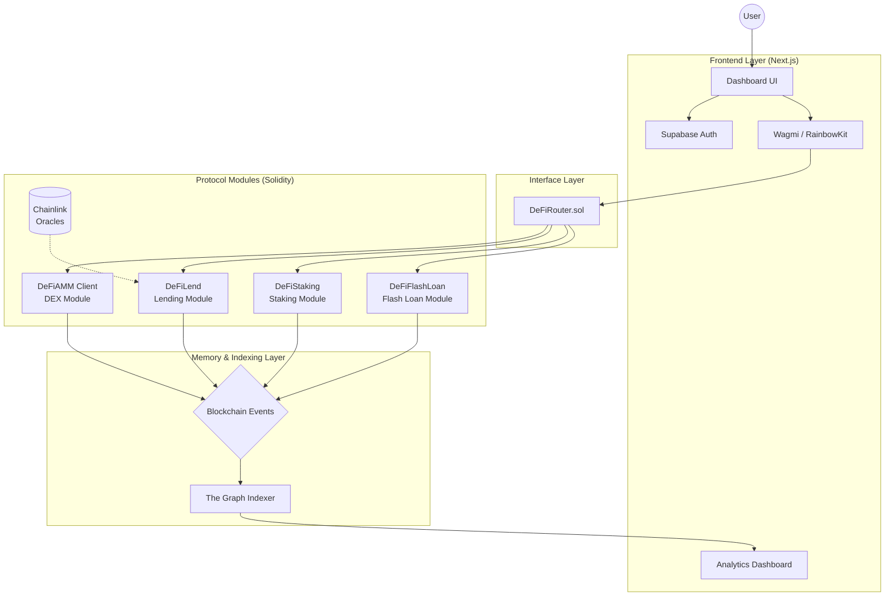

# 🏛️ DeFi Super App: The Complete Protocol Master Guide

This document provides an exhaustive, 360-degree explanation of the **DeFi Super App**. It covers everything from the low-level smart contract logic and economic incentives to the frontend architecture and data indexing layer.

---

## 📖 1. Protocol Philosophy

The DeFi Super App is a modular, production-grade decentralized finance ecosystem. It is designed to be a "Community Bank" where liquidity is shared across four primary primitives: **AMM/Swap**, **Over-collateralized Lending**, **Yield Staking**, and **Flash Loans**.

### Core Pillars:

1.  **Transparency**: Every transaction, liquidation, and reward is calculated on-chain via immutable Solidity code.
2.  **Efficiency**: Gas-optimized structures (like struct packing and custom errors) minimize user costs.
3.  **Data Integrity**: A dedicated Subgraph indexes every event, providing real-time analytics.
4.  **Security**: Multi-layered protections (Reentrancy, Pauser, Oracles) ensure fund safety.

---

## 🏗️ 2. System Architecture

The protocol operates across three distinct layers, ensuring a seamless flow from user interaction to data visualization.

### High-Level Flow Diagram

---

## 🧠 3. Smart Contract Deep Dive

### 🔄 DEX & Swapping (`DeFiAMM.sol` & `DeFiRouter.sol`)

- **Formula**: Constant product `x * y = k`.
- **Fee**: 0.3% per swap, which stays in the pool to increase the value of LP tokens.
- **LP Tokens**: Users receive **DLP (DeFi LP Tokens)** representing their share of the pool.
- **Slippage**: The Router enforces `amountOutMin` and `deadline` to prevent front-running and excessive price impact.

### 🏦 Lending & Borrowing (`DeFiLend.sol`)

- **Model**: Over-collateralized lending (Isolated or Cross-margin capable).
- **Collateral**: WETH (Price monitored via Chainlink AggregatorV3).
- **Borrowing**: USDC (Up to 80% LTV).
- **Liquidation**: If a user's health factor drops below 1.0 (Debt > 80% of Collateral), anyone can liquidate them to claim a **5% bonus**.
- **Interest**: Accrues linearly per second based on the borrow rate.

### 💎 Yield Staking (`DeFiStaking.sol`)

- **Rewards**: Earn **DEFI** (Governance/Reward token).
- **Distribution**: Fixed "reward-per-token" model ensuring fair distribution based on stake time and amount.
- **Yield Loop**: The protocol allows "Recursive Staking" where staked assets can be simultaneously utilized in the lending pool to double the yield.

### ⚡ Flash Loans (`DeFiFlashLoan.sol`)

- **Standard**: EIP-3156 compatible.
- **Fee**: 0.09% (9 basis points).
- **Atomic**: Funds must be returned in the same transaction with the fee, or the entire trade reverts.

---

## 💰 4. Economics & Revenue (The "Owner's" Cut)

The protocol is designed to be self-sustaining. Revenue is generated through:

| Revenue Source      | Rate                 | Recipient                 |
| :------------------ | :------------------- | :------------------------ |
| **Lending Spread**  | 10% of Interest Paid | Treasury (Protocol Owner) |
| **Swap Fees**       | 0.3%                 | Liquidity Providers       |
| **Flash Loan Fee**  | 0.09%                | Treasury / LP Pool        |
| **Liquidation Fee** | 5%                   | External Liquidators      |

### The "Loop" Math:

When a user stakes $100:

1.  They earn **10% Base Staking APR**.
2.  The protocol lends that $100 to the Lending Pool.
3.  The user earns an additional **3.6% Lending APR**.
4.  **Total Yield**: **13.6%** (Aggregated from two sources).

---

## 💻 5. Frontend & Tech Stack

### Technology Matrix:

- **Framework**: Next.js (App Router, TypeScript).
- **Web3 Hooks**: Wagmi v2 + Viem (for contract reads/writes).
- **Wallet**: RainbowKit (supports MetaMask, Coinbase, WalletConnect).
- **Auth**: Supabase (Email/Password & Google OAuth) with a Session Provider.
- **Styling**: Vanilla CSS + Tailwind CSS (Responsive & Dark Mode).
- **Animation**: Framer Motion (Smooth UI transitions).

### State Management:

The frontend fetches data from two sources:

1.  **RPC (Live)**: For user balances, transaction status, and immediate contract state.
2.  **Subgraph (Historical)**: For 24h Volume, TVL charts, and global protocol metrics.

---

## 📊 6. The Subgraph (Indexing Layer)

The Subgraph acts as the "Memory" of the protocol. It parses raw blockchain logs into searchable GraphQL entities.

### Key Entities:

- **Pool**: Tracks reserves, volume, and swap counts.
- **Loan**: Tracks collateral/borrow positions per user.
- **FlashLoanEvent**: Logs initiators and fees for auditability.
- **PositionUpdate**: A unified log for all lending actions (Deposit/Withdraw/Borrow/Repay).

---

## 🛡️ 7. Security Patterns

All contracts are hardened with the following patterns:

- **ReentrancyGuard**: Prevents "The DAO" style recursive calls.
- **Pausable**: An emergency "Kill Switch" for the owner to freeze the protocol in case of an exploit.
- **SafeERC20**: Protection against tokens that don't return boolean values on transfer.
- **Price Staleness**: Chainlink prices older than 1 hour are rejected to prevent trading on "garbage" data.
- **Custom Errors**: Using `error Unauthorized()` instead of `require(condition, "Very long string...")` to save gas on every transaction.

---

## 🚀 8. Deployment Information (Sepolia)

The protocol is currently live on the **Ethereum Sepolia Testnet**.

### Contract Addresses:

| Contract          | Address (@Sepolia)                           |
| :---------------- | :------------------------------------------- |
| **DeFiAMM**       | `0x9bf904562e141c0bfb04d8b70e1c67b43afd403b` |
| **DeFiRouter**    | `0x89e46db557b013a75e788d5faadfb600f89b569c` |
| **DeFiLend**      | `0xde139c3d98c93bd06a074692ca171b8744742712` |
| **DeFiStaking**   | `0x618d4c16fb2d34101c32968f90986ad6f5e23caf` |
| **DeFiFlashLoan** | `0xded027a033a1106d7a85de74afe54e628faa4d39` |
| **DEFI Token**    | `0xd672dccec15daf786238d11c22c1fa3f77f2b287` |

---

## 🏁 9. Conclusion

The DeFi Super App represents a complete, vertically-integrated financial stack. With **automated market making**, **algorithmic lending**, **governance-led staking**, and **data-rich analytics**, it serves as a blueprint for production-grade dApp development.

**Developed with ❤️ and optimized for ⛽.**
